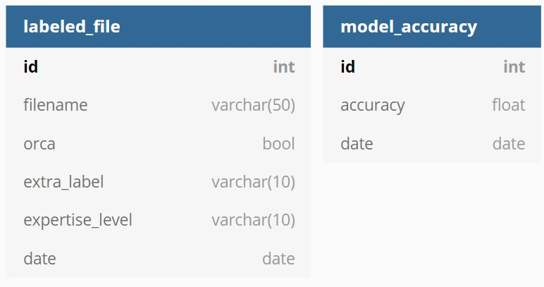

# AL&L of Orca Sounds' API

**Active Listening and Learning of Orca Sounds** is an active learning tool that has the objective of labeling orca sounds with the help of humans and machines.

**This API** serves as an interface between the machine learning model(s) and the webapp. To use it, a postgres db and an ML endpoint are needed.

# Docs

## Database models



**labeled_file** table:  
Label for an audio file made by a human annotator. All the labeled files then conform the labeled dataset used by the ML model.  
**model** table:  
Stores data about a model after every training round, as well as the number of files that were used to train it.  
**confusion_matrix** table:  
Stores the confusion matrix generated after a retraining using the validation dataset.  
**accuracy** table:  
Stores a list of loss and accuracies after every epoch.  
**prediction** table:  
Stores the predicted value of an unlabeled file, alongside with more information about that file.

## Endpoints

-   `GET` [/uncertainties](#get-uncertainties)
-   `POST`[/labeledfiles](#add-labeled-files)
-   `GET` [/statistics](#get-statistics)

-   ### Get Uncertainties
    | URL            | Method | Description                                                            |
    | -------------- | ------ | ---------------------------------------------------------------------- |
    | /uncertainties | GET    | Get the next 5 audio files, in which the ML model had most uncertainty |

#### Success Response

**Code:** `200 OK`  
**Example:**

```JSON
[
  {
    "audioUrl": "https://orcagsoc.s3.amazonaws.com/unlabeled_test/mp3/orcasoundlab_1594154178.mp3",
    "confidence": 44.9466347694397,
    "duration": 3.0,
    "id": 1413,
    "location": "Haro Strait",
    "orca": true,
    "timestamp": "Tue, 07 Jul 2020 15:36:18 GMT"
  },
  {
    "audioUrl": "https://orcagsoc.s3.amazonaws.com/unlabeled_test/mp3/orcasoundlab_1594154799.mp3",
    "confidence": 52.78398394584656,
    "duration": 3.0,
    "id": 1577,
    "location": "Haro Strait",
    "orca": true,
    "timestamp": "Tue, 07 Jul 2020 15:46:39 GMT"
  },
  {
    "audioUrl": "https://orcagsoc.s3.amazonaws.com/unlabeled_test/mp3/orcasoundlab_1594154187.mp3",
    "confidence": 53.031569719314575,
    "duration": 3.0,
    "id": 1414,
    "location": "Haro Strait",
    "orca": true,
    "timestamp": "Tue, 07 Jul 2020 15:36:27 GMT"
  },
  {
    "audioUrl": "https://orcagsoc.s3.amazonaws.com/unlabeled_test/mp3/orcasoundlab_1594154469.mp3",
    "confidence": 53.46974730491638,
    "duration": 3.0,
    "id": 1492,
    "location": "Haro Strait",
    "orca": true,
    "timestamp": "Tue, 07 Jul 2020 15:41:09 GMT"
  },
  {
    "audioUrl": "https://orcagsoc.s3.amazonaws.com/unlabeled_test/mp3/orcasoundlab_1594154163.mp3",
    "confidence": 57.64526724815369,
    "duration": 3.0,
    "id": 1409,
    "location": "Haro Strait",
    "orca": true,
    "timestamp": "Tue, 07 Jul 2020 15:36:03 GMT"
  }
]
```

-   ### Add Labeled Files

| URL           | Method | Description                           |
| ------------- | ------ | ------------------------------------- |
| /labeledfiles | POST   | Add new labeled files to the database |

#### Data Constrains

```JSON
{
    "headers": {
        "Content-Type": "['application/json' or 'text/plain;charset=UTF-8']",
    },
    "body": {
        "labels": "[list of labels]",
        "expertiseLevel": "[can be an empty string][10 chars max]",
        "uncertainties": "[list of ids of the audio files]",
    }
}

label = {
    "id": "[int]",
    "audioUrl": "[unicode 100 chars max]",
    "orca": "[bool]",
    "extraLabel":"[can be an empty string][10 chars max]"
}
```

#### Success Response

**Code:** `201 CREATED`  
**Condition:** If everything is OK  
**Example:**

```JSON
{
    "labels": [{"id": 1409, "audioUrl": "https://orcagsoc.s3.amazonaws.com/unlabeled_test/mp3/orcasoundlab_1594154163.mp3", "orca": true, "extraLabel":"K"}],
    "expertiseLevel": "Beginner",
    "unlabeled": [1492, 1414, 1577, 1413]
}
{"success": true}
```

#### Error Responses

**Code:** `500 SERVER ERROR`  
**Condition:** If fields are missing  
**Example:**

```JSON
{
    "labels": [{"id": 1409, "audioUrl": "https://orcagsoc.s3.amazonaws.com/unlabeled_test/mp3/orcasoundlab_1594154163.mp3", "orca": true}],
    "expertiseLevel": "",
    "unlabeled": []
}
KeyError: 'extraLabel'
```

**Code:** `415 UNSUPPORTED MEDIA TYPE`  
**Condition:** If the Content-Type header is missing or not supported
**Example:**

```JSON
headers: {
    "Content-Type": "application/pdf"
}
{"error": "Unsupported Media Type"}
```

-   ### Get Statistics

| URL         | Method | Description                                                                                                                                                                                 |
| ----------- | ------ | ------------------------------------------------------------------------------------------------------------------------------------------------------------------------------------------- |
| /statistics | GET    | Get confusion matrix, and list of losses and accuracies of last training round of the ML model, as well as the accuracies of the ML model vs the number of files used to train it over time |

#### Success Response

**Code:** `200 OK`  
**Example:**

```JSON
{
  "accuracy": {
    "train": [
      0.5986394286155701
    ],
    "validation": [
      0.6326530575752258
    ]
  },
  "accuracyVLabels": {
    "accuracies": [
      0.644444465637207,
      0.6326530575752258
    ],
    "dates": [
      "Tue, 18 Aug 2020 22:34:32 GMT",
      "Tue, 18 Aug 2020 22:50:40 GMT"
    ],
    "labels": [
      126,
      147
    ]
  },
  "confusionMatrix": [
    9,
    11,
    7,
    22
  ],
  "loss": {
    "train": [
      0.8761522173881531
    ],
    "validation": [
      0.7891138195991516
    ]
  },
  "retrain": {
    "goal": 20,
    "progress": 0
  },
  "training": false
}
```

# Getting Started

This API requires a database and a ML endpoint to run, the easiest way to do that would be run the ML endpoint's docker container by following the [train_and_predict quick method](../train_and_predict/README.md#quick-method), and to start a docker postgres database with the following command: `docker run --name postgres -p 5432:5432 -e POSTGRES_DB=orcagsoc -e POSTGRES_PASSWORD=<database-password> -d postgres`.

### Quick Method

-   Make sure [Docker](https://www.docker.com/) is installed
-   Run the following command with your AWS access keys:  
    `docker run --name activelearning_api -d -p 5000:5000 -e S3_LABELED_PATH=s3://orcagsoc/labeled_test/ -e S3_UNLABELED_PATH=s3://orcagsoc/unlabeled_test/ -e RETRAIN_TARGET=20 -e S3_MODEL_PATH=s3://orcagsoc/models/srkw_cnn_0.h5 -e IMG_WIDTH=607 -e IMG_HEIGHT=617 -e EPOCHS=1 --link postgres:dbserver -e DATABASE_URL=postgresql+psycopg2://postgres:<database-password>@dbserver/orcagsoc -e ML_ENDPOINT_URL=http://host.docker.internal:5001 -e AWS_ACCESS_KEY_ID=<access-key-id> -e AWS_SECRET_ACCESS_KEY=<secret-access-key> --rm jdiegors/activelearning_api:latestt`

### Flexible Method

-   Install [pipenv](https://pypi.org/project/pipenv/) and [AWS CLI](https://aws.amazon.com/cli/)
-   Configure AWS CLI by entering your access keys after `aws configure`
-   Run `pipenv shell` to start a virtual environment
-   Run `pipenv install` to install the required dependencies
-   Create a `.env` file with the following parameters:

    ```
    DATABASE_URL=postgresql+psycopg2://postgres:<database-password>@localhost:5432/orcagsoc
    ML_ENDPOINT_URL=http://127.0.0.1:5001
    S3_LABELED_PATH=s3://orcagsoc/labeled_test/
    S3_UNLABELED_PATH=s3://orcagsoc/unlabeled_test/
    S3_MODEL_PATH=s3://orcagsoc/models/srkw_cnn_0.h5
    RETRAIN_TARGET=20
    IMG_WIDTH=607
    IMG_HEIGHT=617
    EPOCHS=1
    ```

-   Run `flask db upgrade` to update the tables of the database
-   `flask run` starts a development server in http://localhost:5000
-   If you plan to contribute, please configure your text editor / IDE to use Flake8 to lint and YAPF to format Python code

### Testing

-   Run `python -m pytest -v`

### Deployment

Follow the quick start method on your server of choice.  
Otherwise, to push to a different docker container registry, create an account on https://hub.docker.com, login from the command line `docker login`, build the image with `docker build -t activelearning_api .` from within the project directory, rename it to `docker tag activelearning_api:latest <your-docker-registry-account>/activelearning_api:latest`, push it to the Docker registry `docker push <your-docker-registry-account>/activelearning_api:latest`. Now you can follow the quick start method.
