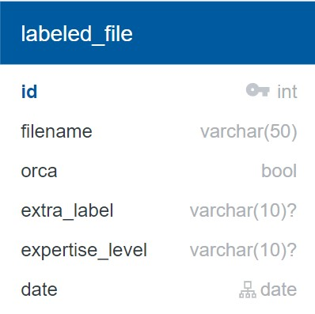

# AL&L of Orca Sounds' API

**Active Listening and Learning of Orca Sounds** is an active learning tool that has the objective of labeling orca sounds with the help of humans and machines.

**This API** serves as an interface between the machine learning model(s) and the webapp.

# Docs

## Database models

**labeled_file** table:  
  
Label for an audio file made by a human annotator. All the labeled files then conform the labeled dataset used by the ML model.

## Endpoints

The service is running on https://orcagsoc.herokuapp.com

-   ### Get Filenames
    | URL        | Method | Description                                                                      |
    | ---------- | ------ | -------------------------------------------------------------------------------- |
    | /filenames | GET    | Get the names of the next 5 audio files, where the ML model had most uncertainty |

#### Success Response

**Code:** `200 OK`  
**Example:**  
The filenames are appended to an s3 bucket url (https://example.s3.amazonaws.com/), and the audio could be fetched using Ajax.

```JSON
[
  "mp3/sound1.mp3",
  "mp3/sound4.mp3",
  "mp3/sound6.mp3",
  "mp3/sound2.mp3",
  "mp3/sound3.mp3"
]
```

-   ### Add Labeled Files

| URL          | Method | Description                           |
| ------------ | ------ | ------------------------------------- |
| /labeledfile | POST   | Add new labeled files to the database |

#### Data Constrains

```JSON
{
    "headers": {
        "Content-Type": "['application/json' or 'text/plain;charset=UTF-8']",
    },
    "body": {
        "labels": "[list of labels]",
        "expertiseLevel": "[can be an empty string][10 chars max]"
    }
}

label = {
    "filename": "[unicode 50 chars max]",
    "orca": "[true or false]",
    "extraLabel":"[can be an empty string][10 chars max]"
}
```

#### Success Response

**Code:** `201 CREATED`  
**Condition:** If everything is OK  
**Example:**

```JSON
{
    "labels": [{"filename": "5", "orca": true, "extraLabel":"K"}],
    "expertiseLevel": "Beginner"
}
```

#### Error Responses

**Code:** `400 BAD REQUEST`  
**Condition:** If fields are missing  
**Example:**

```JSON
{
    "labels": [{"filename": "5", "orca": true}],
    "expertiseLevel": ""
}
```

**Code:** `415 UNSUPPORTED MEDIA TYPE`  
**Condition:** If the Content-Type header is missing or not supported
**Example:**

```JSON
headers: {
    "Content-Type": "application/pdf"
}
```

-   ### Get Statistics

| URL         | Method | Description                                                                                                                                |
| ----------- | ------ | ------------------------------------------------------------------------------------------------------------------------------------------ |
| /statistics | GET    | Get confusion matrix and list of accuracies of last training round of the ML model, as well as the total number of labeled files over time |

#### Success Response

**Code:** `200 OK`  
**Example:**

```JSON
{
  "accuracy": {
    "test": [0.12, 0.45, 0.67, 0.78, 0.82, 0.89, 0.9, 0.92, 0.925],
    "train": [0.2, 0.5, 0.7, 0.8, 0.85, 0.9, 0.92, 0.925, 0.93]
  },
  "confusionMatrix": [
    [80, 46],
    [43, 100]
  ],
  "validationHistory": [
    ["Wed, 24 Jun 2020 00:00:00 GMT", 2],
    ["Thu, 25 Jun 2020 00:00:00 GMT", 6],
    ["Fri, 26 Jun 2020 00:00:00 GMT", 8]
  ]
}
```

# Getting Started

-   Install [pipenv](https://pypi.org/project/pipenv/)
-   Run `pipenv shell` to start a virtual environment
-   Run `pipenv install` to install the required dependencies
-   You also need a local sqlite database, so use the `flask db upgrade` command to create one
-   `flask run` starts a development server in http://localhost:5000
-   If you plan to contribute, please configure your text editor / IDE to use Flake8 to lint and YAPF to format Python code

### Testing

-   Run `python -m pytest -v`

### Deployment

-   Once the [Heroku CLI](https://devcenter.heroku.com/articles/heroku-cli) is installed, login to your Heroku account with `heroku login`
-   Then add a remote to your local repository with the `heroku git:remote -a orcagsoc` command
-   To deploy the app use the `git push heroku master` command from your local repository's master branch
